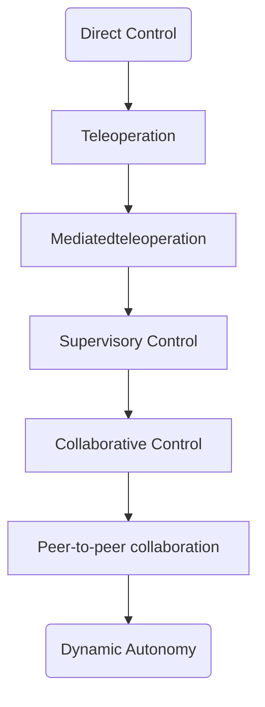

{
	"title": "Computation and Society",
	"mermaid": true,
	"math": false,
	"backlinks": []
}

> This is mostly a translation to English of the notes originally provided by [Baltasar Dinis](https://www.edenbox.org/index.php/s/edenbox?path=%2FLEIC%2F3%C2%BA%20Ano%2F2%C2%BA%20Semestre%2FCS%2FResumos#pdfviewer).

## Ethics

### Definitions

**Ethics** is the set of values deducted by an individual according to which they evaluate their actions. It can be also defined as the rules or behaviour standards that are expected from an individual by a group.

It is relevant to study Ethics in Computer Science due to the impact this field has on the society. Most of the times, the decisions taken by a Computer Scientist are not just theoretical.

**Morality** is the set of values based on a collective knowledge that define whether an action is good or bad. In contrast to Ethics, Morality belongs to the social context and it's the base of the social normals.

#### Morality Variation Factors

- Age → _Generational Ethics_
- Cultural group
- Ethnicity
- Religion
- Life experiences
- Education
- Sex

An individual has **integrity** if their actions are based upon their own opinions, the opinions they share with others.

**Making ethical decisions**:

1. Identify the problem and describe it in a concise way.
2. Identify alternatives.
3. Evaluate and pick an alternative.
4. Take the decision.

### Professional Responsability

The globalization and generalization of Information Technologies makes it even more important to study Ethics in the context of technology.

It is important to promote ethical conducts because we need to act correctly. However, it is also important from the business point of view:

- Connection to the communicty.
- Organization consistency.
- It's a good practice.
- Protects the organization and the employees from litigation.
- Avoids bad advertising.

### Ethics in Organizations

In an organization, is it important to:

- Have an ethics manager.
- Define (by the administration board) the ethical norms of the organization.
  - Define, carry them out and enforce them.
- Have an ethical code of conduct with the key ethical questions.

The ethical code of conducts - like [ACM's](https://www.acm.org/diversity-inclusion/code-of-ethics), which is a standard among organizations in the field - stipulate the fundamental principles. However, it requires an ethical judgement in order to understand it.

The **ACM's Code of Conduct** is based on 8 principles:

1. Public Interest
2. Client and Employer
3. Product
4. Common Sense
5. Management
6. Profession
7. Colleagues and Teams
8. Yourself

## Security and Computer-oriented Crimes

**Computer-oriented crimes** are crimes where computers are used.

**Cybercrimes** are crimes that happen on the cyberspace.

**Computer virus** is a malicious program that propagates itself on files and programs, "infecting" them. Tipically, user action is required.

**Worm** is a malicious program that replicates itself in order to propagate to other computers.

Some attacks:

- **Sniffing**: consists on intercepting and capturing data on a network.
- **DDoS** (Distributed Denial of Service): use a distributed network of computers to flood a target's network, making it slow.
- **Carding**: steal credit card information.
- **Trojan**: computer malware that misleads the user intent.
- **Phishing**: obtain sensitive information such as usernames, passwords and credit card details by disguising oneself as a trustworthy entity in an electronic communication.
- **Spear Phishing**: phishing targeted to specific companies and individuals.
- **Smishing**: phishing through SMS.
- **Ransomware**: malware that requires the user to pay to retrieve their data.
- **Defacing**: is an act of vandalism where a website gets modified.

The main solution for the cyber crimes that invole the user's action is giving users awareness and help on how to filter emails.

The Portuguese law 109/2009 suplements the penal code with information about cybercrimes.

- **ANACOM** (Autoridade NAcional de COMunicações): the national authority of communications.
- **CNPD** (Comissão Nacional de Proteção de Dados): the national data protection authority.

### Software Reproduction

It is illegal to make illicit copies and/or distribute them.

**Warez** is pirated software.

### General Data Protection Regulation

The General Data Protection Regulation (GDPR) refers to all EU citizens and has the following goals:

- Give data's holders control about them.
- Give responsability to companies and other data controllers.
- Give transparency to how the data is processed.
- Reduce the vulnerabilities related to personal data.
- Improve the cooperation between authorities that supervise personal data processing.

**Personal information** is any information that can be related to someone that is or can be identified.

The GDPR is based on 6 principles about personal information:

1. **Lawfulness, fairness and transparency**: the data are processed in a legal, just and transparent way.
2. **Purpose limitation**: data must be collected for specific, explicit and legitimate purposes.
3. **Data minimisation**: collected data must be adequate, relevant and limited to the strict needs.
4. **Accuracy**: data must be precise and updated when required.
5. **Storage limitation**: data must be kept in a way that they cna be easily identified and remove when not necessary.
6. **Integrity and confidentiality**: the data processing must have enough security measures to protect them.

## Intelectual Property

**Intelectual property** is the legal concept that deals with intellectual property and its exclusivity rights.

### Author's Rights

TODO

### Intelectual Property Rights

The protected value is of the creation. There are many types:

- Patent: lasts for 20 years of exclusivity.
- Utility model: lasts for 6+2+2 years of exclusivity.
- Industrial design rights: lasts for 25 years and can be renewed every 5 years.
- Unregistred industrial design.

**Patent** is a legal document that allows the owner to stop the manufacture, usage and comercialization of an invention by other people. It can protect products or production methods and has geographic limits. The first one to register it, gains the rights.

A patent requires:

- Be something **new**.
- It can't be **obvious**.
- Must have an **industrial application**.

Aditionally, it is also required:

- **Sufficiency**: the request must have enough detail to allow for repeatability.
- **Support**: the request must show what the invention does.

**Trade secrets** are confidential intelectual property of a company.

There are advantages:

- They have no time limit.
- They don't need to be registred.
- They don't need to be disclosed.

And disadvantages:

- Hard to license and value.
- Hard to keep confidentiality.
- Hard to fight for the rights.
- Can be patented by others.

**Trademark** is an identifier for each product of a company.

## Information Technologies Impact

With the advent of computing, the social structure has been changing rapidly and dramatically. There are, of course, certain questions to discuss:

- In which way is the technological revolution changing the way we organize?
- In which way does that change our human rights:
  - Mainly, the freedom of speech.

### Privacy

**Privacy** is a right described in the Universal Declaration of Human Rights, where everyone must be given **confidentiality** to their communications and **privacy** to their data.

The privacy on the Internet is a complex problem since there are techniques such as Canvas Fingerprinting, Cookies and many other vulnerabilities.

Some recent outrages about the right of privacy include the Chinese social credit system, the British surveillance system and the right to be forgotten (discussed in the EU due to the GDPR).

### Net Neutrality

**Net neutrality** is the principle that Internet service providers (ISPs) must treat all Internet communications equally, and not discriminate or charge differently based on user, content, website, platform, application, type of equipment, source address, destination address, or method of communication.

### Freedom of Speech

**Freedom of speech** is the individual and collective right to express and spread one's opinion by speaking in an unlimited way.

Freedom of speech is one of the pillars of the Internet. However, this breaks a timeless flow that has been unbreakable for many years: from the traditional communication media (that adhere to a code of ethics) to reads. Currently, this flow is not directed in a particular way, being done from everyone to everyone.

**Hate speech** is defined as a public speech that expresses hate or encourages violence towards a person or group based on something.

### AI and Equality

The AI has been changing the work market in a drastic way, affecting worker's productivity.

**Productivity** is the quotient between the amount of work and the retail value of a product. Or the amount of work done per input unit. It can be measured by GDP (gross domestic product) per hour.

Economic inequality has been worsening. However, developed countries may not feel the change in productivity in increasing inequality. In other contries, however, this has been felt as a sudden change.

## AI and Autonomy

**Autonomy** is the ability of a machine to determine how and when to hit its own goals and execute its tasks without any external control.

This scale (**Sheridan scale**) establishes levels between a machine being fully operated by a human and being completely autonomous, not needing human intervention to execute actions.

With the improvement of machine's autonomy, it is clear that people are delegating more of their tasks to machines. For example, through voice assistants, such as Google Assistant, Siri and Alexa. These are technological changes that have the power to deeply change our society.

### Autonomous Agents

TODO

### Anthropomorphism

TODO

### Bias

**Bias** is disproportionate weight in favor of or against an idea or thing, usually in a way that unfair.

With the development of the AI, some question if we may be adding to technology our own biases.

## Social Networks

Today we are more and more connected to each other through many forms of social networks. In some cases, social networks have completely replaced our traditional social media. Thus, it is important to understand how these connections are made.

The networks' structure are tree-like: there are few nodes with tons of connections, and most of them connect to this centralized nodes.

Usually, content propagation occurs in two ways:

- **Simple ways**: being in touch with the content is enough.
- **Complex ways**: multiple exposures to the content are needed.

In the social network context, we observe a complex content propagation system. It is important to note that social media can be used as a mass media manipulation tool.

### Advertisement

**Advertisement** is the usage of a network to promote benefits of products and services.

- Banners
- Viral Marketing
- AdvertGames