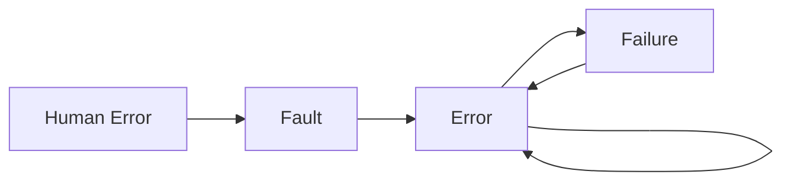

{
	"title": "Fault, Error, Failure",
	"mermaid": true,
	"math": false,
	"backlinks": [
		{
			"Target": "/fault-tolerance",
			"Before": "Unknown",
			"Actual": "faults",
			"After": "Unknown"
		},
		{
			"Target": "/software-engineering",
			"Before": "Unknown",
			"Actual": "faults, errors and failures",
			"After": "Unknown"
		}
	]
}

Developers are human and that leads to bugs. An human error creates a fault, which generates an error, which may generate more errors and lead to a failure. Usually, the biggest problem is to identify the faults and not to fix them.

- **Human error**: an human action which produces software faults.
- **Fault**: an omission, a defect, in the software caused by an human error that changes the way a certain system component behaves.
- **Error**: an unexpected change in the system behavior and state caused by a fault.
- **Failure**: an observable error. The system deviates from its specification.

When an error occurs, it can either be detected and processed, making sure the service continues to work. Or it can cause a failure where the service starts being unavailable.

Examples:

- **Fault**: the power cord is unplugged.
- **Error**: the CPU and other components do not work.
- **Fault**: the computer does not turn on.

## Latent State

A latent fault, i.e., a fault that is there but cannot be detected, can cause a latent error that can turn out causing a failure.

## Fault Classification

- **Cause**
  - **Physical**: electric phenomena, ...
  - **Human**
    - Accidental: bad design, bad operation...
    - Intentional: calculated attack
- **Origin**
  - **Internal**: internal components, program, ...
  - **External**: lack of energy, high temperature, ...
- **Duration**
  - **Permanent**
    - Persist until being repaired
    - Easy to detect
    - Usually hard to repair
  - **Temporary** or transient
    - Only during a short period of time
    - Hard to reproduce, detect
    - Usually easy to repair
    - Some systems may tolerate transient faults by self-repair
- **Independence**
  - **Independent**
    - Probability of occurrence of a fault in a component is independent of other components
    - Usually, hardware related
  - **Dependent**
    - Related probability of occurrence
    - Examples: software failures, multiple hardware components (same physical location)
- **Determinism**
  - **Deterministic**
    - Only depend on a certain input sequence and the current system state
    - Easy to reproduce
  - **Non deterministic**
    - Can depend on non-deterministic factors such as threads, clock reads, message order, ...
    - Hard to reproduce and debug