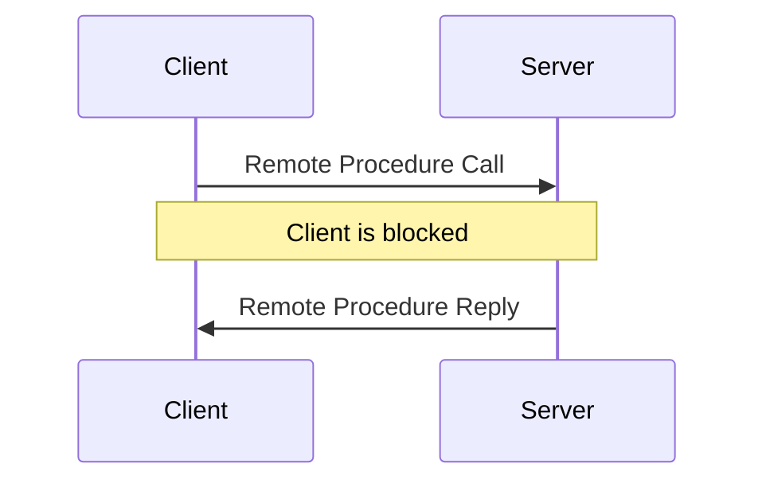

{
	"title": "Remote Procedure Call",
	"mermaid": true,
	"math": false,
	"backlinks": [
		{
			"Target": "/interface-description-language",
			"Before": "Unknown",
			"Actual": "Remote Procedure Call",
			"After": "Unknown"
		},
		{
			"Target": "/primary-backup",
			"Before": "Unknown",
			"Actual": "*at most once*",
			"After": "Unknown"
		},
		{
			"Target": "/remote-method-invocation-rmi",
			"Before": "Unknown",
			"Actual": "Remote Procedure Call",
			"After": "Unknown"
		},
		{
			"Target": "/remote-method-invocation-rmi",
			"Before": "Unknown",
			"Actual": "failure semantics",
			"After": "Unknown"
		},
		{
			"Target": "/grpc",
			"Before": "Unknown",
			"Actual": "Remote Procedure Call",
			"After": "Unknown"
		}
	]
}

**Remote Procedure Call**, also known as RPC, tries to solve the communication problem on [Distributed Systems](/distributed-systems/) by creating a simple interface to work over the network. RPC creates an abstraction layer over sockets and other network low-level specifics.

## Goals

- To look like a local procedure call for the developer, but being executed remotely.
- The developer should only worry about its [Business Logic](/business-logic/).
- To organize the distributed programming by remotely calling procedures on other machines.

## Benefits

- Procedure calls can behave synchronously.
- Simplifies remote calls by building, marshalling and unmarshalling the messages.
- Hides [Transport Layer](/transport-layer/) specifics, such as addressing, receiving and sending messages, as well as error handling.
- Simplifies the documentation process, as the interface is independent of the transport protocols.

## Challenges

There are generic and project-specific challenges that usually come up when building a distributed system. However, these are easily solved by RPC libraries.

**Generic**

- Find the server port.
- Stablish the communication channel.
- Send, resend and filter duplicate messages.

**Project-specific**

- Define the message structures.
- Create the request/reply message.
- Convert and serialize parameters.

The programmer only needs to specify the interface and implement it, while the RCP compiler and runtime libraries generate the required code code for it to work.

## Structure

An [IDL](Interface%20Description%20Language) is required in order to specify the interface that is going to be used.

There are certain data types that cannot be obviously passed, such as pointers, or [passage by reference](Programming%20Fundamentals#parameters). The transmitted data types need to be serializable.

### Stubs

For each function, both the client and the server have a stub. On the **client** side, the stub:

- converts the parameters
- creates and sends the request
- receives the request
- converts the return value

On the **server** side, the stub:

- receives the request
- converts the parameters
- calls a local function
- converts the local function return value
- creates and sends the replies.

## Failure Semantics

The execution semantics is always considered from the point of view of the **client**. What does it mean if the request returned? What does it mean if the request failed?

### Server Failure

- **Maybe** - If the client does not receive a reply in the timeout limit, an error is thrown and the client **does not know** if the request was executed or not. If they receive a reply, they know the request was processed *at least once*.
- **At least once**
  - If the client does not receive a reply in a given time, the client repeats the request until the receive a reply. If the client receives a reply, they know the request was processed *at least once*. To avoid getting the client forever blocked, there is a timeout, but it is larger.
  - Should only be used for idempotent functions, i.e., functions that can be applied more than once and the result won't change.
- **At most once**, if the client gets a reply from the server, it means that the request was processed *at most once* on the server. The server does not execute duplicated requests. The control protocol must detect repetitions and keep information about the handled requests.
- **Exactly once**, if the client receives a reply, then it means the server did execute the request *exactly once*. The server does not execute duplicated requests. It can use a transactional model with rollbacks in case of failure.

Necessary mechanisms to ensure semantics:

- **Maybe**: RPC Timeout
- **At least once**: Maybe + Resend
- **At most once**: At least once + Message ID + Response History
- **Exactly once**: At most once + Transaction Rollback

## Naming System

There needs to be a naming system in order for the client to find the servers.

The servers register themselves on the registry of the naming system. Then, the client connects to the naming system to find an available server.
