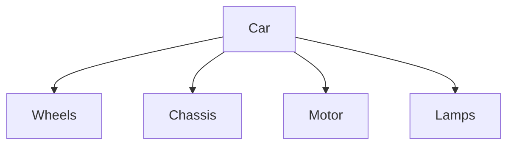

{
	"title": "Systems Analysis and Modeling",
	"mermaid": true,
	"math": false,
	"backlinks": []
}

## Fundamentals

### System

A **system** is a group of entities that interact with a specific purpose that cannot be achieved by a solo entity.

A system is always a relative concept and it always depends on the convern and the context related to that. The context depends on the purpose and converns of the stakeholders of the system.

A system context model represents the direct environment of the system and gives initial information about the communication flowing from and to the system.

The external interaction partners are the system actors. The communication itself is described by information flows.

### Systems Engineering 

**Systems Engineering** is the field of engineering that focus on how to design and manage complex systems over their life cycles, making them useful and successful. It:

1. identifies and qualifies the system goals,
2. creates alternatives system design concepts,
3. selects and implements the best design,
4. verifies that the design is properly built and integrated, and
5. assesses on how well the system actually meets the goals.

### Information System

An **information system** is a group of sociotechnical entities (technological and human) interacting with the purpose of satisfying all the information needs of an organization.

### Model

A **model** is an artefact that representes something and it is used to help people to know, to understand and to communicate the subject matter it represents.

### Conceptual Model

A **conceptual model** is a non-physical model that describes a real world state of affairs. For example: philosophical models, scientific models, social and political models...

### System of Interest

A **system of interest** is a system that is being understood, created, used or managed due to a specific concern. Outside of the boundary of these systems, we can find **enabling systems** that are required to complement the functionality of the system of interest but are out of the scope of the system of interest. Example: if a _phone_ if a system of interest, the cellullar network can be an _enabling system_.

### Architecture

**Architecture** defines the fundamental concepts or properties of a system in its environment embodied in its elements, relationships, and in the principles of its design and evolution.

A **system architecture** is a formal representation of a system that defines the structure and the properties of its components, as well as the relationships between them (behaviour). It also defines the principles required for the analysis, design, implementation and evolution of the system

### Systems Classification

| Hard Systems | Soft Systems |
| -- | -- |
| Well-defined problem. | Problem is loosely defined due to an unobjective reality.|
| Stakeholders share a common view of the problems. | Stakeholders interpret problems differently. |
| Scientific approach to problem-solving. | Several approaches to problem-solving including scientific approaches. |
| Mostly deals with engineering-related factors. | Socio-technical and human factors also need to be considered. |
| The usual purpose is finding an ideal solution that addresses all the converns of the stakeholders. | Finding an ideal solution may not be goal. Alternative purposes include learning and better understanding the system. |

### White and Black box

There are two main ways of modelling a system: the white box and the black box. Let's use a car as an example.

**Black box** relates to the driver's perspective and cares about what is the functionality.
  - **Function**: relationship between input and output.
  - **Behaviour**: manifestation of the function in the course of time.

**White box** related to the mechanic's perspective and cares about how is it made:
  - **Construction**: the components and their interaction relationships.
  - **Operation**: manifestation of the construction in the course of time.

### Structure and Behaviour

Structure and behvaiour are two general ways of classifying viewpoints. We assume that both of these concepts are related to concerns that most of the times can be pragmaticallt separated orthogonally.

**Structure** refers to the recognition, observation, nature and stability of patterns and relationships of entities.

**Behaviour** refers to the actions of the system. It is the response of the system to various inputs, whether internal or external.

### Modelling

Modelling is used to help people communicate in an unambiguous way in order to solve problems.