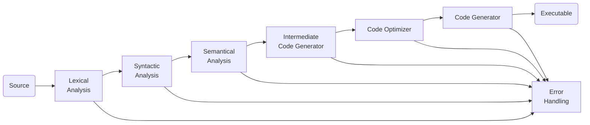

{
	"title": "Compiler",
	"mermaid": true,
	"math": false,
	"backlinks": [
		{
			"Target": "/code-optimization",
			"Before": "Unknown",
			"Actual": "Compiler",
			"After": "Unknown"
		}
	]
}

A compiler is a program that transforms a program written in the source language - taken as input - and produces a file in a different language. Usually, it's a binary file that can be executed by the machine, but it doesn't need to.

There are many types of language processors:

- **Transpilers** convert between high-level languages. For example, from JavaScript to Python.
- **Compilers** convert from a high-level language to a low-level language. For example, from C to machine language.
- **Decompiler** convert from executables to high-level languages.

## Compiler Phases

Generically, the compilation process can be divided into two major steps: **analysis** and **synthesis**. Analysis takes the source code, easily readable by a human, as input and creates an intermediate representation of that source code. Synthesis takes that representation and transforms it into the final target program.

1. [Lexical Analysis](/lexical-analysis/)
2. [Syntactic Analysis](/syntactic-analysis/)
3. [Semantic Analysis](/semantic-analysis/)
4. Intermediate Code Generation
    - After the semantic analysis, the compiler generates an intermediate code of the source code that is note coupled to a certain machine. It is somewhat translate to connect between this code and the target machine code.
5. [Code Optimization](/code-optimization/)
6. Code Generation
    - Finally, the code generator takes the optimized representation of the intermediate code and maps it to the target machine language. The output of this phase can be executed by the target machine.

<!--

Symbol Table
It is a data-structure maintained throughout all the phases of a compiler. All the identifier's names along with their types are stored here. The symbol table makes it easier for the compiler to quickly search the identifier record and retrieve it. The symbol table is also used for scope management.

-->

## References

- https://web.tecnico.ulisboa.pt/~david.matos/w/pt/index.php/T%C3%B3picos_sobre_Constru%C3%A7%C3%A3o_de_Compiladores
- https://efxa.org/2014/05/17/techniques-for-resolving-common-grammar-conflicts-in-parsers/
- https://www.gnu.org/software/bison/manual/html_node/Shift_002fReduce.html