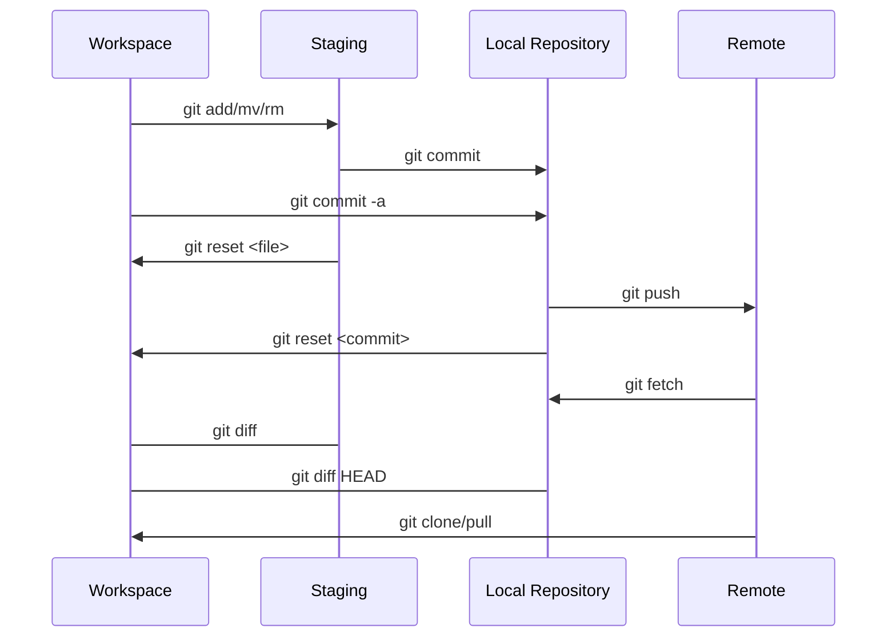

{
	"title": "Git",
	"mermaid": true,
	"math": false,
	"backlinks": [
		{
			"Target": "/software-engineering",
			"Before": "Unknown",
			"Actual": "Git",
			"After": "Unknown"
		}
	]
}

Git is a [distributed](/distributed-systems/) version control system for tracking changes in source code during software development.



## How it works

- Immutable objects represent files (`blob`), directories (`tree`) and changes (`commit`).
- Content-addresses by cryptographic hashes.
- Forms a Merkle DAG.
- Most metadata is just references. Hence, inexpensive to update or create.
- Version changes only update references or add objects.
- Version changes to other users is just transferring objects and updating remote references.

## Stage

```bash
# Stage all
$ git add -A

# Add specific files
$ git add paths...

# Remove specific files
$ git rm paths...
```

## Branching

More on [git branching](https://git-scm.com/book/en/v2/Git-Branching-Basic-Branching-and-Merging).

### Create

```bash
# Create a new branch
$ git branch <branch-name>

# Checkout the new branch
$ git checkout <branch-name>

# Create and checkout a new branch
$ git checkout -b <branch-name>
```

### Merge

More on [branch merging](https://git-scm.com/book/en/v2/Git-Branching-Basic-Branching-and-Merging).

```bash
# Checkout master
$ git checkout master

# Merge hotfix into master
$ git merge hotfix
```

### Delete

```bash
$ git branch -d <branch-name>
```

## Reset

We can reset a file to another commit via:

```bash
$ git reset <commit> <file...>
```

- By default, the command just unstages the files.
- By omitting the file, the entire repository will be reverted.
- By adding the flag `--hard`, the entire repository reverts to the specified commit.

### Revert (reflog)

Git keeps a log of all ref updates (checkout, reset, commits, merges, etc). It can be viewed with:

```bash
$ git reflog

# Ref log for specific branches
$ git reflog show <branch>

# Revert last `git reset`
$ git reset 'HEAD@{1}'
```